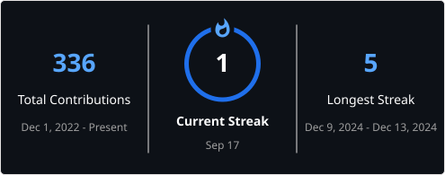

<!-- Header -->

---

## 🛠️ My Tech Stack

### 🤖 AI / Machine Learning

### 🐍 Programming Languages

### ⚙️ Frameworks & Libraries

### 🧰 Developer Tools

### 🔬 Research

---

## 📊 GitHub Stats

 

---

## 🐍 My Contribution Snake

---

## 📫 Connect With Me

 

